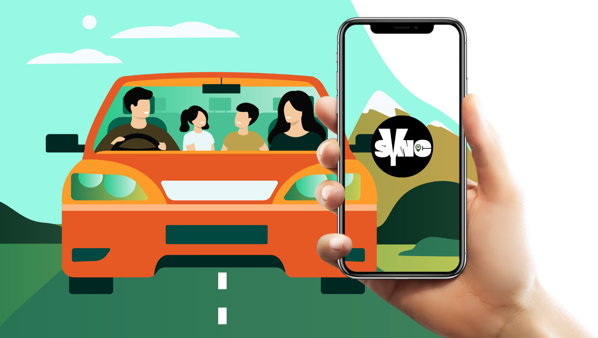

# 🛺 SYNC 🚖

**SuperApp designed by Students for Students**

## 🌟 Vision
Sync is more than just a carpooling app – it’s a complete student mobility and community platform. Our goal is to make college travel easier, more affordable, and eco-friendly while also connecting students through a vibrant marketplace and community forum.

With Sync, students can:

1. **🚗 Carpool easily**: Share rides, split costs, and reduce traffic.
2. **💬 Engage in a community forum**: Discuss college life, share advice, and connect with peers.
3. **🛍️ Buy & sell in the student marketplace**: Find books, gadgets, or even rent a ride.

Crafted by tech wizards, Sync is your magic carpet for campus life—zipping you around affordably, sustainably, and with a splash of social spice!

## 🌱 Our Core Values

### 🚀 Easy & Fast – No Hassle, Just Results
Sync is built to make student life simpler. Whether you need a ride, want to sell something, or ask a question, it all happens in just a few taps. No complicated steps, no unnecessary delays—just a smooth and quick experience that gets things done without frustration.

### 💰 Saves Money – Travel & Shop Without Breaking the Bank
College expenses add up fast, and transportation is one of the biggest costs. With Sync, you can share rides and split the cost, making travel way cheaper than taxis or ride-hailing apps. Plus, our student marketplace helps you buy and sell books, gadgets, and essentials at lower prices, saving money while helping other students.

### 🔒 Safe & Secure – Trusted by Students, for Students
When sharing rides or making deals, safety is a top priority. Sync only allows verified users, so you always know you’re interacting with real students from your college. Whether you're riding with someone, buying an item, or chatting in the community, you can do it with peace of mind, knowing that Sync prioritizes trust and security.

### 🌍 Good for the Planet – Less Traffic, Less Pollution
Every car on the road adds to traffic and pollution. With Sync, fewer cars means cleaner air and less congestion. By choosing to carpool, students are actively helping the environment while also making commuting more affordable and efficient. It's a small step toward a greener and smarter future.

### 🤝 Strong Community – Students Helping Students
Sync isn’t just an app—it’s a student-powered network where help is always available. Need a ride? Study materials? Advice on college life? The community forum lets students connect, share experiences, and support each other. Whether you’re looking for academic help, social connections, or just a good deal on second-hand books, Sync brings students together in one place.

With Sync, you're not just using an app—you're becoming part of a smarter, safer, and more supportive student community! 🚀

## ❓ Why Solve This Problem?
**College students struggle with:**

Expensive and unreliable transportation.
Finding trusted places to buy/sell books, gadgets, or services.
A lack of a dedicated online space to connect with peers.
Sync solves all these issues in one platform, making daily life more convenient, cost-effective, and socially engaging.

## 🎯 📍 Our Journey So Far
- ✅ Developed a smart carpooling system.
- ✅ Built a community forum for student discussions.
- ✅ Created a student marketplace for buying/selling.
- 🚀 Launching soon to transform student life!
- 🎯 Expanding to more colleges and features.

## ✨ Thanks to all contributors

Thank you for your support in Sync's growth. Keep up the great work! 🥂

